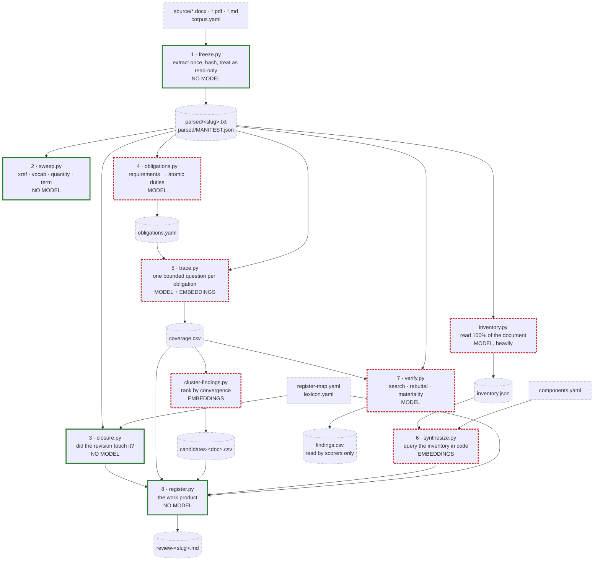

# dossier — architecture

`README.md` says what to run. `DESIGN.md` says why each decision was made and
what was measured. This file is the middle one nobody had written: the shape of
the pipeline, what each stage actually consumes and emits, and the one invariant
the whole thing rests on.

It was written by reading the scripts, not by summarising the other two
documents, and it disagrees with them in a few places. Those places are marked.

---

## The eight stages

Each stage is a standalone script with its own `--help`. Nothing imports a
framework; the only thing shared between stages is `llm.py` and a small amount
of code reuse (`verify.py` imports `chunk`/`retrieve` from `trace.py`,
`register.py` imports the matching logic from `closure.py`). The chaining is
done by the `dossier` wrapper, which is a `subprocess.call` loop — not an
orchestrator, and deliberately so (`DESIGN` §3.22).

| # | Script | Consumes | Emits | Model |
|---|---|---|---|---|
| 1 | `freeze.py` | `corpus.yaml`, the source files it names, an extractor (`extract.py`) | `parsed/<slug>.txt` per document, `parsed/MANIFEST.json` | no |
| 2 | `sweep.py` | `parsed/MANIFEST.json` + the frozen text; `purpose-terms.txt` for `vocab` | stdout only — counts and line numbers, no file | no |
| 3 | `closure.py` | two frozen revisions, `register-map.yaml`, `lexicon.yaml` | stdout; CSV with `--out` | no |
| 4 | `obligations.py` | the frozen requirements document | `obligations.yaml` | yes — unless `--no-model` |
| 5 | `trace.py` | `obligations.yaml`, the frozen deliverable, `lexicon.yaml` | `coverage.csv` | yes — chat **and** embeddings |
| 6 | `synthesize.py` | `inventory.json` from `inventory.py`, `components.yaml` | stdout; candidate CSV with `--out` | embeddings; chat only with `--adjudicate` |
| 7 | `verify.py` | `coverage.csv`, the frozen deliverable | `findings.csv` | yes |
| 8 | `register.py` | `register-map.yaml`, both frozen revisions, and whichever of `coverage.csv` / candidates / synthesis / an `.xlsx` matrix exist | `review-<slug>.md` | no |

Four of the eight construct neither a `Client` nor an `Embedder`: `freeze.py`,
`sweep.py`, `closure.py`, `register.py`. That is checkable rather than claimed —
`grep -c 'Client(\|Embedder(' freeze.py sweep.py closure.py register.py` returns
zero for each. `register.py` will read an `.xlsx` comment matrix, but it
does so through `matrix.read_sheet`, which is hand-rolled OOXML over `zipfile`
and `xml.etree` and never calls a model.

So the work product at stage 8 — the document you actually send — is produced
without inference, from artefacts produced with it. That is the property worth
noticing, and the README's stage table states it without drawing the conclusion.

### Two stages sit beside the numbered eight

- **`cluster-findings.py`** runs immediately after `trace.py` — `dossier
  coverage` chains it — and turns flat coverage rows into clusters ranked by
  convergence (`DESIGN` §3.20). Embeddings only, no chat model.
- **`inventory.py`** is the stage that feeds `synthesize.py`, and it is the
  most model-expensive thing here: one bounded call per section over the whole
  document, multiplied by `--runs` — the default union is three passes, so a
  74-section fixture costs ~222 calls, not 74. `synthesize.py` cannot run
  without it.

`undefined.py` is a detector rather than a pipeline stage. It is included below
because it is the clearest working example of the invariant.

---

## The pipeline



Solid outline and `NO MODEL` mean the stage is deterministic and exactly
reproducible; dashed outline means inference is involved. The labels carry the
distinction as well as the colours, because the colours will not survive a
grayscale print and this is the one thing in the diagram worth not losing.

**What the diagram is honest about, and the docs are not:**

- `findings.csv` is a leaf. Nothing downstream reads it — `register.py` accepts
  `--coverage`, `--candidates` and `--synthesis`, and has no flag for verified
  findings. Its consumers are both scorers — `score.py`, and `score-register.py`
  via `--findings`, which keeps only rows whose `status` is `confirmed` or
  `contested`. So stage 7 informs a human and the scoring harness, not the work
  product.
- There is no `dossier obligations` and no `dossier verify` subcommand. The
  wrapper registers `add freeze review closure sweep coverage cluster report
  inventory matrix writeback doctor status` — stages 4 and 7 are run by calling
  the scripts directly.

---

## The data contract between stages

Four objects travel between stages. Everything else is a CSV column.

### A frozen corpus

`corpus.yaml` names documents; `freeze.py` extracts each one **once** into
`parsed/<slug>.txt` and records it in `parsed/MANIFEST.json` with `slug`,
`role`, `path`, `source_sha256`, `source_bytes`, `text_sha256`, `text_lines`,
`parsed` and an optional free-text `note`.

`role` is a closed vocabulary — `anchor`, `requirements`, `draft`, `reference` —
because tooling branches on it: `obligations.py` warns when the document is not
`requirements` or `reference`, and `trace.py` warns that a `draft` is diffable
but not citable. Anything you want to say beyond those four words goes in
`note`, which is carried into the manifest untouched (`DESIGN` §3.32).

Both hashes are kept because they answer different questions. `source_sha256`
says the input file is the one you meant; `text_sha256` says the extraction has
not been edited since. `freeze.py --check` re-computes both and exits non-zero
on either. A plain `freeze.py` run that detects drift now **refuses to write the
manifest** — the earlier version detected it, discarded it, and then recorded
the new source hash against the old parsed text, so every subsequent `--check`
reported clean and the guarantee was silently gone.

### A locator

`<slug>:<line>` for a point, `<slug>:<start>-<end>` for a span. Line numbers
index `parsed/<slug>.txt`, never the `.docx` or the PDF.

That is the whole reason for the freeze. A locator is stable because the text it
points into is written once and thereafter treated as read-only; the only way to
re-extract is `freeze.py --refreeze`, whose own help text shouts that it
INVALIDATES LOCATORS. Extraction is not deterministic across extractor versions,
so "re-parse and re-check" would quietly move every line number in every finding
already filed (`DESIGN` §3.1, §3.2).

Two details that only show up in the code:

- `text_lines` is `len(text.splitlines())`, not `count("\n") + 1`. The latter
  reported one line more than any locator could reach for every file ending in a
  newline.
- Passage locators come from `trace.chunk()`, which splits on headings and caps
  each chunk at 60 lines **or** 3000 characters. The character cap exists
  because a line-only cap assumes every document wraps at around 80 characters:
  unwrapped prose — contracts, mostly — runs to several hundred characters per
  line, and a 60-line window then holds one "passage" that is most of the
  document, useless to retrieve and too large to send.

### An obligation

A record in `obligations.yaml`, one atomic duty each. This is the first entry of
the fixture's own file, unedited:

```yaml
  - id: O-001
    modality: SHALL
    subject: "the Contractor"
    text: "The Contractor SHALL scope the minimum viable product to the administrative boundary of Port Meridian only."
    source_ref: "R-001"
    scope: "unscoped"
    section: "3.1 Purpose and scope"
    locator: requirements:19
```

`modality` is an RFC 2119 keyword from a closed set, validated on the way out of
the model. `scope` names which deliverable owes the duty, because one
requirements document governs several deliverables and judging one against all
of them fills the matrix with structural false positives (`DESIGN` §3.6) — this
is what `trace.py --scope` filters on and what `dossier status` prints so you
know the options exist.

**`scope` is only ever populated by `--mode chunk`.** Only `CHUNK_SYSTEM` asks
for it, and only `validate_chunk` requires it; sentence mode has no scope in the
record it builds, so `emit_yaml` writes the `"unscoped"` fallback. Every one of
the 59 obligations in `fixtures/floodtwin/obligations.yaml` is `"unscoped"`,
which means `trace.py --scope architecture` against that file matches nothing
and exits — see the contradictions below.

The extraction has a deterministic floor: pass 1 finds every sentence carrying
an RFC 2119 modal, which fixes the denominator before any model runs, so you can
tell afterwards whether the model dropped any (`DESIGN` §3.5). `--no-model`
stops there, and that is the baseline the model pass has to beat. `--mode chunk`
exists because the dominant form in a real tender is a stem carrying the modal
followed by an enumerated list, and sentence mode finds the five stems while
missing the eighty requirements underneath them.

### A candidate

The word means two things here and the repository is careful about both.

A **coverage row** is a judgement about one obligation: `obligation`,
`source_ref`, `modality`, `requirement`, `verdict`, `quote`, `locator`,
`reason`, `absence_gate`, `gate_evidence`, `requirement_locator`. Verdicts are
`met`, `partial`, `unmet`, `unverifiable`, plus `not_applicable` for a `MAY`
that the deliverable simply did not exercise (`DESIGN` §3.15). `trace.py`
finishes by printing that unmet and partial rows are finding CANDIDATES, not
findings.

A **cluster** is `cluster-findings.py`'s output — `rank`, `obligations`,
`strength`, `verdicts`, `lead_requirement`, `lead_reason` — grouping rows that
are about the same gap and ranking by how many obligations converge on it. A
lone verdict on a long document is where the false positives live; convergence
is the signal that survived measurement (`DESIGN` §3.20).

Neither is a finding. The promotion step is a human reading the quote in
context. `verify.py` sits in between and attacks each candidate with three
lenses, of which only `search` and `rebuttal` vote on truth — `materiality`
answers a different question and is reported as a separate flag, because an
immaterial finding is still true and a material one can still be wrong
(`DESIGN` §3.9). A lens that *errors* is recorded as `failed` and forces the row
to `contested`, never read as "did not refute" (`DESIGN` §3.11).

The quote is the load-bearing part of all of it. A `met` or `partial` verdict
whose quote does not appear verbatim in the passages supplied is rejected and
retried, then downgraded: the model is not permitted to invent the evidence for
its own verdict (`DESIGN` §3.4).

---

## The invariant: absence is computed, never asked

An absence claim is the least reliable thing a reader can produce, and it gets
worse the more there is to read — that is measured, not asserted, in `DESIGN`
§3.18. So the shape everywhere in this repository is: **the model proposes, the
corpus disposes.** A model is asked what a passage *contains*. Whether something
is *missing* is a property of the whole document, and the whole document is
searched in code.

### Where it holds

**`undefined.py`** is the cleanest case. One bounded agent per ~1200-character
section nominates terms a reader would need defined, and is told in the prompt
that it cannot see the rest of the document and must not judge whether a term is
defined elsewhere. Every nomination is then checked by `is_defined()` against
the entire text for four things: a definitional copula, a definition-list line,
a glossary section, or a heading of its own. Nothing the model says survives
without corroboration, and the model never gets to say "this is undefined".

The tuning history is instructive about how easy the check is to get wrong. An
early `DEFINITION` pattern accepted a hyphen after the term and cleared most
nominations, because hyphens join compound words on every page. An early
glossary detector treated any line mentioning "definitions" as a glossary and
swept up a large block of following text, building a blob inside which
everything looked defined — so the detector reported nothing at all. It now
requires a heading and stops at the next one. Both failures are silent in the
direction of finding less, which is the dangerous direction for this check.

**`closure.py`** never calls a model. `UNCHANGED`, `STILL ABSENT`, `REMOVED`,
`ADDED`, `CHANGED`, `ABSENT` and `TOO BROAD` all come from collecting the lines
carrying a finding's terms in each frozen revision and comparing them. The
distinction between `STILL ABSENT` (the finding *is* that something is missing —
so nothing in either revision is the answer) and `ABSENT` (a broken query) is
carried by `absence: true` in `register-map.yaml`, because the same counts mean
opposite things and only the register knows which.

**`sweep.py`** reports counts and line numbers and refuses to say "absent" at
all. Its docstring is explicit: a zero is a LEAD, not a finding. `vocab` prints
the count and the first locator for every purpose term; `xref` prints
identifiers referenced exactly once and structural pointers with no matching
heading. The judgement that any of it is a defect is left outside the tool.

**`inventory.py` → `synthesize.py`** generalises the pattern to the whole
document. Section agents are told they never assert absence; the dual-binding,
ownership-gap, orphan-workstream and untrue-self-claim queries then run in code
over a finished inventory (`DESIGN` §3.21). `synthesize.py`'s docstring says it
plainly: absence becomes legitimate there for the first time, because the
inventory was built by reading 100% of the document rather than a sample.

### Where it does not

**Every `unmet` row from `trace.py`, in the default configuration, is a model
asserting absence from retrieved passages.** `DESIGN` is honest about this and a
summary should not hide it.

The default is `--retrieval embed` with `--passages 12`: rank the chunks by
embedding similarity to the obligation, hand the top twelve to the model, and
ask whether the deliverable discharges it. The model sees a sample and answers
about the document. The system prompt works hard on the problem —

> NOT SEEING SOMETHING IS NOT THE SAME AS IT BEING ABSENT. You are shown a few
> passages, not the document.

— and instructs the model to answer `unmet` rather than hedge to `partial`,
because hedging produces findings that evaporate on contact. But that makes the
error *honest*, not *absent*. A prompt is not a mechanism, and §3.18 is the
measurement of how far a prompt gets you.

Three things partially compensate, and it is worth being precise about how far
each goes:

- **The absence gate** (on by default; `--no-absence-gate` disables it) checks
  the obligation's vocabulary, expanded through `lexicon.yaml`, against the
  whole document. `clear` — the document never uses the vocabulary at all — is a
  genuinely high-confidence absence and is rare. `contested` means the
  vocabulary is present, and the code's own comment says it means almost
  nothing: the topic is usually discussed while the required artefact is still
  missing. It is a confidence annotation on one side only, not a verification.
- **The screen fallback** fires when retrieval returns nothing at all for an
  obligation. It asks every chunk the narrow positive question from
  `CHUNK_SYSTEM` — "does *this* passage contribute?" — and computes absence from
  all the answers. That restores the invariant, but only for the obligations
  retrieval gave up on entirely. `--no-screen-fallback` turns it off and reports
  `unmet` on a vocabulary miss, which is wrong exactly when the deliverable
  answers in its own words (`DESIGN` §3.7).
- **`--exhaustive`** applies that same positive question to every chunk for every
  obligation. Its own help text is the clearest statement of the trade in the
  repository: it "Removes the absence judgement", and costs chunks × obligations
  calls. This is the mode where the invariant holds fully, and it is not the
  default because of what it costs.

`verify.py` does not make the problem worse and does not fix it. Its `search`
and `rebuttal` lenses ask a positive question — find the evidence that refutes
this finding — and default to `refuted: false` when they cannot. Failing to find
evidence is recorded as a failure to refute, never as a confirmation of absence;
a `confirmed` status means two attacks failed, which still inherits whatever
sampling produced the underlying `unmet`. `UNIVERSAL` obligations are demoted
from `refuted` to `contested` for the mirror-image reason: a universal cannot be
disproved from a sample either (`DESIGN` §3.14).

The short version, which is the one to keep: `sweep`, `closure`, `undefined` and
the inventory path compute absence. `trace` estimates it, and labels the
estimate. `DESIGN` §6 lists "unmet precision decays with length and nothing
compensates" as an open problem rather than a solved one.

---

## Where the code contradicted the documents

Recorded here rather than fixed, because these files are outside the scope of
the change that added this document.

- **`llm.py` defaults to Ollama on `localhost`**, with a comment explaining that
  a default nobody else can reach is indistinguishable from a broken tool. The
  `dossier` wrapper's own docstring still says endpoints "default to this
  homelab". The wrapper is the stale one.
- **The per-script defaults did not follow `llm.py`.** `obligations.py`,
  `trace.py` and `verify.py` each hardcode their own `--model` and `--url`
  defaults, and `trace.py`, `verify.py` and `synthesize.py` each hardcode an
  `--embed-model` that differs from `llm.DEFAULT_EMBED_MODEL`. The wrapper's
  comment says the single resolution path in `llm.py` exists precisely so that
  `./trace.py` and `dossier coverage` reach the same endpoint — and because the
  cache key hashes the model name, they currently do not, so the same question
  asked two ways still produces two cache entries.
- **`dossier coverage --vllm` is a no-op** unless `DOSSIER_VLLM_URL` and
  `DOSSIER_VLLM_MODEL` are set: they default to the same values as the normal
  path, and `cmd_coverage` calls `model_args()` without a concurrency argument,
  so the flag adds nothing at all. Only `dossier inventory` passes concurrency.
- **`README`'s new-engagement workflow cannot run as written.** It heads the
  coverage step "extract obligations and trace them", but `dossier coverage`
  runs `trace.py` and `cluster-findings.py` only, and `trace.py` exits with "no
  obligations.yaml — run obligations.py first". There is no wrapper subcommand
  that produces `obligations.yaml`.
- **`README` says to always pass `--scope`, and the default extraction mode
  cannot satisfy it.** Only `obligations.py --mode chunk` assigns a scope;
  `--mode sentence`, the default, writes `"unscoped"` for every obligation. So
  the documented `dossier coverage . --doc X --scope architecture` exits with
  "no obligations with scope 'architecture'" against anything extracted the
  default way, including the fixture as it ships.
- **`verify.py` writes a `scope` column it can never fill.** It reads
  `row.get("scope", "")` from the coverage CSV, and `trace.py` does not write a
  `scope` column — the value is in `obligations.yaml` and is dropped at the
  coverage boundary. Every `scope` cell in `findings.csv` is empty.
- **`README` marks `synthesize` as a model stage.** It is mostly not: it uses
  embeddings for concept grouping and constructs a chat `Client` only under
  `--adjudicate`. The model cost of that branch of the pipeline lives in
  `inventory.py`, which the README's stage table does not list.
- **`DESIGN` §5's inventory table has seven rows**, five of them stage scripts —
  `freeze.py`, `sweep.py`, `obligations.py`, `trace.py`, `verify.py` — plus
  `llm.py` and the fixture. `closure.py`, `register.py`, `synthesize.py`,
  `inventory.py`, `undefined.py` and `cluster-findings.py` are all discussed
  elsewhere in the document but missing from its own inventory, so the
  eight-stage story is not visible there.
- **`check-refs.py` now scans this file**, and did not when it was written.
  Adding the filename was not enough: every citation here is written `` `DESIGN`
  §3.4 ``, and the pattern ran DESIGN straight into the section number, so all
  eighteen references — and a deliberately planted dangling one — were invisible.
  The regex accepts the backtick now, verified by planting a citation to a
  section number that does not exist and watching the check fail. (Writing that
  number here would trip the very check this paragraph describes — which is the
  third tool in this repository to need an exemption from itself.)

---

## Reading the code in the order it runs

`freeze.py` first — it is short, it has no model in it, and the manifest it
writes is the contract every other stage reads. Then `closure.py`, which is the
whole toolkit in miniature: a real question, answered by string matching over
two frozen texts, with the states named so that "nothing happened" is a
first-class result. Then `trace.py`, which is where the model enters and where
most of the judgement about how to use one lives. `llm.py` last, when you want
to know how the caching, validation, retry and dead-endpoint detection work.

The fixture in `fixtures/floodtwin` is a fictional flood-response procurement
with planted defects and, more importantly, planted decoys — `DC-003` is a state
vector said to be "defined below" and enumerated on the very next line, `DC-005`
is a threshold with no value that is nonetheless disclosed with a named owner
and therefore not a defect. A fixture that scores only recall trains tools to
flag everything (`DESIGN` §4).
